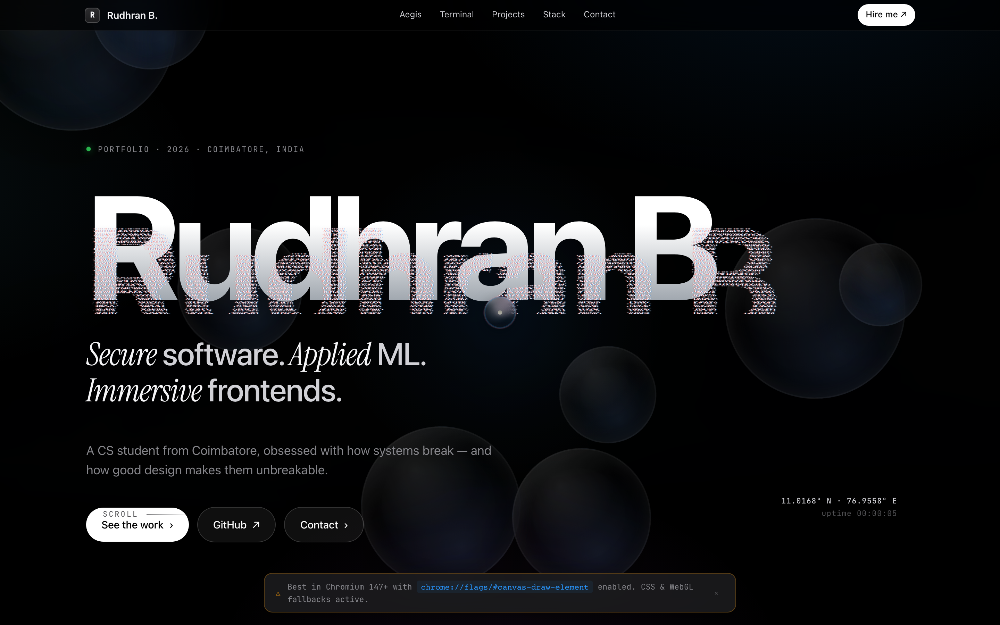

# Rudhran B — Portfolio

> **Live:** [rudhran.netlify.app](https://rudhran.netlify.app)  ·  **Mirror:** [rudhran-nine.vercel.app](https://rudhran-nine.vercel.app)



A single-file, Apple-flavored portfolio for **Rudhran B** — CS student from Coimbatore, obsessed with how systems break and how good design makes them unbreakable.

Built as one self-contained `index.html` — every effect is Canvas / WebGL / CSS, no build step, no framework.

---

## What's inside

- **Hero** — pixel-disintegration assembly on every section heading, italic Instrument Serif emphasis, hero parallax that tilts to the cursor
- **Aegis** — WebGL2 fragment shader doing flow-noise + mouse-driven ripple refraction, live threat feed with sparkline ticker
- **macOS Terminal window** — traffic lights, gradient title bar, working zsh-style shell underneath (`help`, `about`, `ls`, `projects`, `project aegis`, `aegis run`, `matrix`, `neofetch`, `theme`, `goto`, `email`, tab-complete, history)
- **Refined cursor system** — backdrop-blur glass lens with chromatic-aberration ring, precision dot using `mix-blend-mode: difference`, soft trail ribbon, 520px spotlight glow, magnetic snap to interactive elements, Apple-palette lightning crackle that arcs to buttons and shockwaves on click
- **Projects** — 3D flip cards with page-curl highlight; live data from the GitHub profile
- **Stats / CRT panel** — phosphor stats with scanlines, count-up on scroll
- **Contact** — frosted-glass panel, pixel-sort headline, copy-to-clipboard with cyan burst
- **Smart nav** — auto-hides on scroll down, returns on scroll up

## Stack

- HTML5 · CSS3 (custom properties, backdrop-filter, `mix-blend-mode`)
- Canvas 2D + WebGL2 (raw shaders, no Three.js bloat — Three only inside specific project cards)
- Vanilla JS — no framework, no bundler
- Fonts: Inter, JetBrains Mono, Instrument Serif (Google Fonts)

## Run locally

```bash
git clone https://github.com/rudhrancodes-dev/rudhran-portfolio.git
cd rudhran-portfolio
# any static server works, e.g.
python3 -m http.server 8080
```

Then open `http://localhost:8080`.

## Deploy

Drag `index.html` onto [app.netlify.com/drop](https://app.netlify.com/drop), or push to a Vercel-connected repo and it deploys on commit.

## Author

**Rudhran B.** — Coimbatore, India  
- GitHub: [@rudhrancodes-dev](https://github.com/rudhrancodes-dev)
- Email: rudhran.codes@gmail.com

---

## Share with a friend

> Built my new portfolio — single-file HTML, all effects in pure Canvas / WebGL / CSS, no framework.
>
> **Live:** https://rudhran.netlify.app
>
> A real macOS Terminal panel you can type into, a refined glass cursor with Apple-palette lightning that snaps to buttons, a WebGL ripple shader on the Aegis monitor, and pixel-disintegration on every heading. Worth a hover.
>
> Code: https://github.com/rudhrancodes-dev/rudhran-portfolio
